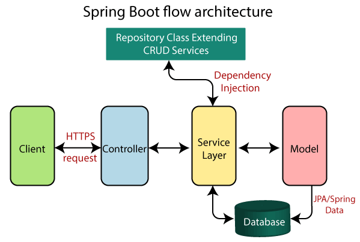

# Locadora de Veículos

## Descrição do Projeto

Este projeto é uma solução para uma locadora de veículos, desenvolvido com o objetivo de implementar um sistema de gerenciamento eficiente para veículos alugados. A aplicação inclui as seguintes funcionalidades principais:

- **CRUD de Veículos:** Permite a criação, leitura, atualização e exclusão de registros de veículos.
- **Inativação de Veículos:** Implementa a funcionalidade de desativar veículos, para que não estejam mais disponíveis para locação.

O projeto visa consolidar os conhecimentos adquiridos ao longo de dois anos de desenvolvimento e aplica conceitos de engenharia de software.

## Tecnologias Utilizadas

Neste projeto, utilizamos as seguintes tecnologias:

 
  
  
  
  
  
  

## Arquitetura do Sistema

A arquitetura do sistema foi projetada com base no modelo de arquitetura do Spring Boot, conforme descrito no site [Javatpoint](https://www.javatpoint.com/spring-boot-architecture). O sistema segue a arquitetura de microsserviços, que inclui os seguintes componentes principais:

1. **Camada de Apresentação (Controller):** Responsável por lidar com as requisições HTTP e fornecer respostas apropriadas.
2. **Camada de Serviço (Service):** Contém a lógica de negócio e interage com a camada de repositório.
3. **Camada de Repositório (Repository):** Gerencia o acesso aos dados e interage com o banco de dados.
4. **Banco de Dados:** Armazena as informações dos veículos e das operações de locação.

O microsserviço `rental-company-abrao-lemos` foi desenvolvido para atuar como a porta de entrada da locadora. Este microsserviço gerencia as operações principais e se comunica com outros serviços para garantir a funcionalidade completa do sistema.

### Diagrama de Arquitetura

Abaixo está um diagrama que ilustra a arquitetura do Spring Boot e foi retirado do site acima, que foi a base para o desenvolvimento deste projeto:

## Futuras Melhorias

Para expandir e enriquecer o sistema, está planejado o desenvolvimento futuro de:

- **Fluxo Completo de Locadora:** Implementação de diversos microsserviços para cobrir todas as funcionalidades necessárias para uma locadora completa.
- **Batch Processing:** Adição de processos em lote para otimizar e gerenciar operações em grande escala, completando o ecossistema da Locadora Abrão Lemos.
